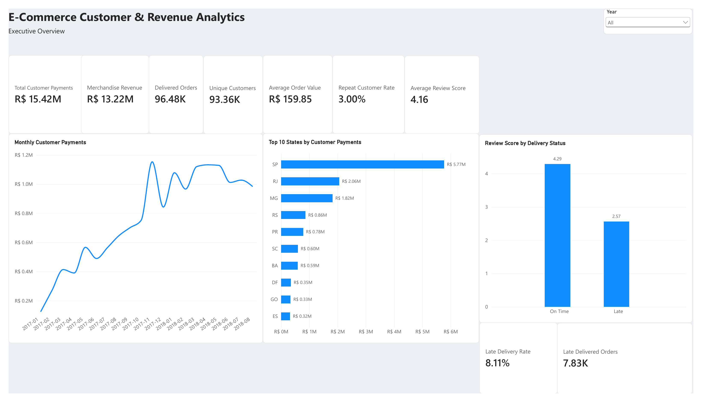
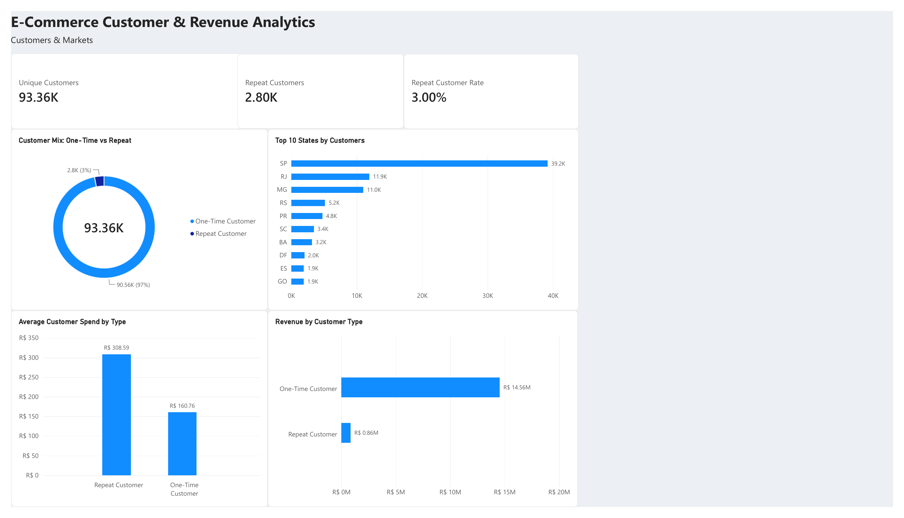
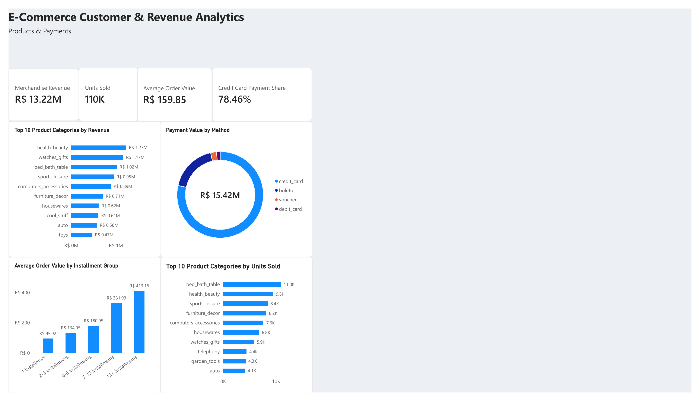
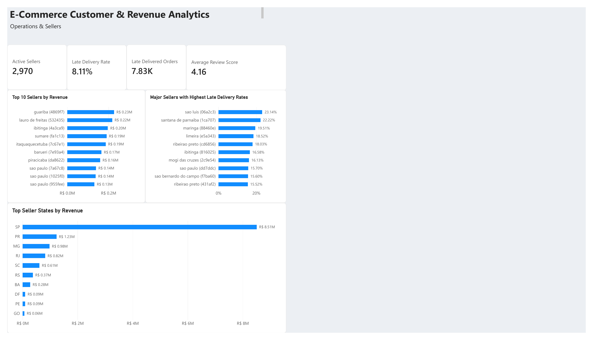

# E-Commerce Customer & Revenue Analytics

An end-to-end e-commerce analytics project using **SQL, Python, and Power BI** to analyze customer behavior, revenue performance, product sales, payment patterns, delivery performance, and seller operations.

## Project Overview

This project transforms raw e-commerce transaction data into a structured analytical model and interactive Power BI dashboard designed to answer key business questions across customers, revenue, products, payments, and operations.

The final dashboard contains four report pages:

- Executive Overview
- Customers & Markets
- Products & Payments
- Operations & Sellers

## Dashboard Preview

### Executive Overview


### Customers & Markets


### Products & Payments


### Operations & Sellers


## Data Source

This project uses the **Brazilian E-Commerce Public Dataset by Olist**, containing real anonymized marketplace orders from Brazil.

The dataset includes multiple relational tables covering:

- Customers and geographic information
- Orders and delivery timestamps
- Order items and product prices
- Products and product categories
- Sellers
- Payment methods and installments
- Customer reviews

The raw tables were profiled, validated, cleaned, and transformed in Python before being analyzed with SQL and modeled in Power BI.

> The raw dataset is not included in this repository. The repository focuses on the analytical workflow, code, and final dashboard outputs.

## Tools Used

- SQL — data querying and analysis
- Python — data preparation and exploratory analysis
- Power BI — data modeling, DAX measures, visualization, and dashboard development
- Power Query — data transformation and cleaning

## Key KPIs

| Metric | Result |
|---|---:|
| Total Customer Payments | R$ 15.42M |
| Merchandise Revenue | R$ 13.22M |
| Delivered Orders | 96.48K |
| Unique Customers | 93.36K |
| Average Order Value | R$ 159.85 |
| Repeat Customer Rate | 3.00% |
| Average Review Score | 4.16 |
| Late Delivery Rate | 8.11% |
| Late Delivered Orders | 7.83K |

## Dashboard Analysis

### Executive Overview

Provides a high-level view of commercial and operational performance, including:

- Monthly customer payment trends
- Revenue and order KPIs
- Geographic payment distribution
- Review scores by delivery status
- Late delivery performance

### Customers & Markets

Analyzes customer behavior and geographic concentration.

Key findings include:

- 93.36K unique customers
- 2.80K repeat customers
- 3.00% repeat customer rate
- Repeat customers have substantially higher average spend than one-time customers
- São Paulo represents the largest customer market

### Products & Payments

Examines product performance and customer payment behavior.

Key findings include:

- R$ 13.22M in merchandise revenue
- 110K units sold
- R$ 159.85 average order value
- Credit cards account for 78.46% of payment value
- Health & Beauty is the highest-revenue product category
- Bed, Bath & Table leads in units sold
- Average order value increases significantly for customers using larger installment plans

### Operations & Sellers

Evaluates seller activity and delivery performance.

Key findings include:

- 2,970 active sellers
- 8.11% late delivery rate
- 7.83K late delivered orders
- 4.16 average review score
- São Paulo dominates seller revenue
- Several major sellers record late delivery rates above 20%

## Key Business Insights

- Revenue and customer activity increased substantially throughout the analysis period.
- Customer retention presents a major opportunity, with only 3% of customers classified as repeat customers.
- Repeat customers generate significantly higher average spending than one-time customers.
- Credit cards dominate the payment mix.
- Higher installment usage is associated with significantly larger order values.
- Late deliveries are strongly associated with lower customer review scores.
- Revenue is highly concentrated geographically, particularly in São Paulo.

## Dashboard

The completed Power BI dashboard is available here:

[Ecommerce Analytics Dashboard (PDF)](Ecommerce_Analytics_Dashboard.pdf)

> The editable Power BI `.pbix` source file is not publicly distributed. It is available upon request.

## Repository Structure

```text
ecommerce-customer-revenue-analysis/
│
├── python/
│   ├── 01_data_overview.py
│   ├── 02_relationship_audit.py
│   ├── 03_data_cleaning.py
│   ├── 04_build_analysis_dataset.py
│   ├── 05_business_performance.py
│   ├── 06_product_category_analysis.py
│   ├── 07_customer_cohort_analysis.py
│   ├── 08_payment_behavior.py
│   ├── 09_customer_rfm_analysis.py
│   ├── 10_seller_performance.py
│   └── README.md
│
├── sql/
│   ├── 01_database_setup.sql
│   ├── 02_business_kpis.sql
│   ├── 03_customer_analysis.sql
│   ├── 04_product_seller_analysis.sql
│   ├── 05_payment_delivery_analysis.sql
│   └── README.md
│
├── Executive_Overview.png
├── Customers_and_Markets.png
├── Products_and_Payments.png
├── Operations_and_Sellers.png
├── Ecommerce_Analytics_Dashboard.pdf
├── requirements.txt
└── README.md
```

## Author

**Paniebi Karis Ovuru**

Data Analyst | SQL | Python | Power BI  
